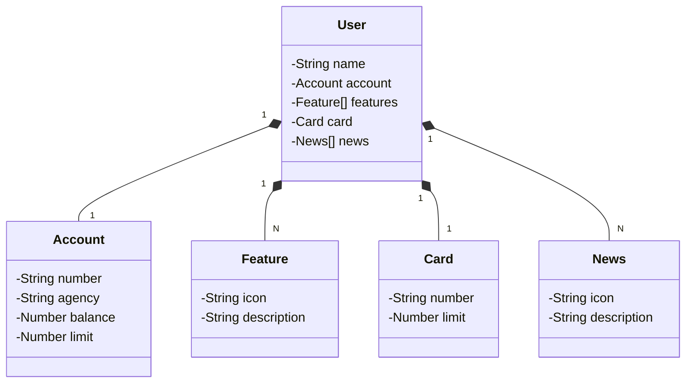

# Desafio do curso Trilha Java da DIO/Claro.

## Diagrama de Classes

## Getting Started

Repositório criado para salvar meu projeto em conjunto com a DIO "Publicando Sua API REST na Nuvem Usando Spring Boot 3, Java 17 e Railway"
Desafio do curso Trilha Java da DIO/Claro ministrado pelo instrutor Venilton FalvoJr.

## Desenvolvimento

<h2>Ferramentas utilizadas</h2>

- ``Java``
- ``IDE VScode``
- ``Railway``
- ``Spring Boot 3``
- ``Spring Data JPA``
- ``OpenAPI``

## Tecnologias Essenciais

-Java 17: Adotaremos a versão LTS mais atual do Java para aproveitar as últimas melhorias e recursos dessa linguagem robusta e amplamente utilizada;
-Spring Boot 3: Utilizaremos a versão mais recente do Spring Boot, que aumenta a produtividade do desenvolvedor através de sua poderosa capacidade de autoconfiguração;
-Spring Data JPA: Vamos utilizar essa ferramenta para simplificar a camada de acesso aos dados, facilitando a integração com bancos de dados SQL;
-OpenAPI (Swagger): Criaremos uma documentação de API clara e compreensível usando OpenAPI (Swagger), alinhada com a alta produtividade proporcionada pelo Spring Boot;
-Railway: Facilitaremos o deploy e monitoramento de nossas soluções na nuvem, além de oferecer diversos bancos de dados como serviço e pipelines de CI/CD.

<h2>Desenvolvedor</h2>

(https://github.com/felipebfs - https://www.linkedin.com/in/felipe-batista-fraga-de-sousa-8a169822a/)
